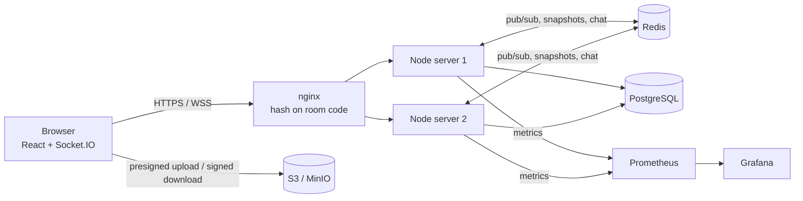
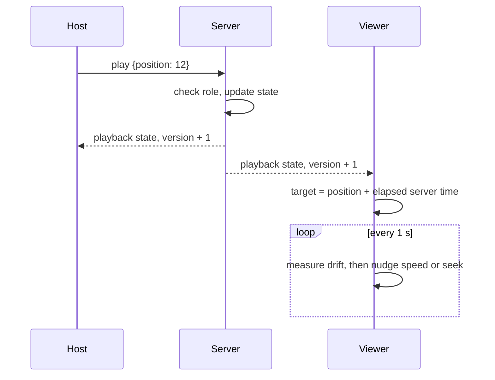

<!-- ======================= HEADER ======================= -->
<div align="center">


<a href="https://github.com/tejas-gupta-dev">
  
</a>

<br/><br/>


<br/><br/>

**[Flagship Project](#-flagship-project-watch-party)** &nbsp;·&nbsp; **[More Projects](#-more-projects)** &nbsp;·&nbsp; **[Skills](#%EF%B8%8F-skills)** &nbsp;·&nbsp; **[Engineering Practices](#-engineering-practices)** &nbsp;·&nbsp; **[Contact](#-lets-connect)**

</div>

<br/>

<!-- ======================= ABOUT ======================= -->
## 👨‍💻 About Me

I build software end to end: React front ends, Node.js back ends, real-time systems, and ML features that run in the browser. I care about how things work under the hood, from clock synchronization between devices to how a service behaves when it's scaled across servers.

```js
const tejas = {
  role: "Software Engineer (full-stack, real-time systems, ML)",
  languages: ["TypeScript", "JavaScript", "Python", "C++"],
  strongestAt: ["Real-time systems", "Full-stack web apps", "Applied ML"],
  currentlyBuilding: "Real-time, emotion-aware, AI-powered web apps",
  exploring: ["Distributed Systems", "Computer Vision", "Databases"],
  funFact: "I taught a webcam to pick my playlist 🎵",
};
```

<br/>

<!-- ======================= FLAGSHIP ======================= -->
## ⭐ Flagship Project: Watch Party

<div align="center">

### 🎬 Synchronized video rooms, built like a production system

*Create a room, share a 6-character code, and every viewer's player stays in lockstep.*

<a href="https://github.com/tejas-gupta-dev/Watch-Party">
  
</a>

<br/>


</div>

<br/>

**The problem:** keeping several people's video players in sync is hard. Network latency differs per device, clocks disagree, and users pause, seek and reconnect at unpredictable times.

**The approach:** the server is the single source of truth, and every client corrects itself against it.

| Engineering challenge | How I solved it |
|:--|:--|
| ⏱️ **Clock differences between devices** | NTP-style offset estimation: 8 ping round trips per client, keeping the lowest-latency sample |
| 🎯 **Staying in sync without stutter** | Playback is stored as an anchor `{position, updatedAt, playing}`. Small drift is fixed by nudging playback speed (max ±8%), large drift by seeking |
| 🔐 **Who can do what** | One shared permission matrix (host, moderator, participant) used by both the UI and the server, with every handler checking it before changing state |
| ✋ **Controlled access to playback** | Participants *request* changes, and hosts and moderators approve or reject them from a live queue |
| 📡 **Scaling past one server** | Multiple Node instances behind nginx, rooms pinned to a node by hashing the room code, events fanned out through the Redis Socket.IO adapter |
| 🔁 **Reconnects and late joiners** | Full state snapshot on join, version numbers to discard stale updates, graceful connection draining on shutdown |
| 🎞️ **Large video files** | Browser uploads directly to S3-compatible storage with presigned URLs (up to 4 GB), so media never touches the realtime path |
| 📈 **Knowing it works** | Prometheus metrics and a Grafana dashboard (sockets, rooms, latency, drift), 22 unit and integration tests, GitHub Actions CI, and a k6 load test |

<details>
<summary><b>🏗️ System architecture</b></summary>

<br/>



</details>

<details>
<summary><b>🔄 How one sync event flows</b></summary>

<br/>



</details>

<div align="center">

<a href="https://github.com/tejas-gupta-dev/Watch-Party"></a>

</div>

<br/>

<!-- ======================= MORE PROJECTS ======================= -->
## 🚀 More Projects

<div align="center">
<table>
  <tr>
    <td align="center" width="50%">
      <a href="https://github.com/tejas-gupta-dev/EmotionMusic">
        
      </a>
    </td>
    <td align="center" width="50%">
      <a href="https://github.com/tejas-gupta-dev/migrane">
        
      </a>
    </td>
  </tr>
  <tr>
    <td align="center" width="50%">
      <a href="https://github.com/tejas-gupta-dev/movie_recommender_system">
        
      </a>
    </td>
    <td align="center" width="50%">
      <a href="https://github.com/tejas-gupta-dev/tinydb">
        
      </a>
    </td>
  </tr>
</table>
</div>

<br/>

| Project | What it does | Stack |
| :-- | :-- | :-- |
| 🎵 **[EmotionMusic](https://github.com/tejas-gupta-dev/EmotionMusic)** ([live demo](https://emotion-music-beta.vercel.app)) | Reads your facial expression through the webcam in real time and recommends music that matches your mood | `React` `Node.js` `Express` `MongoDB` `MediaPipe` |
| 🧬 **[Migraine Analysis](https://github.com/tejas-gupta-dev/migrane)** | Classifies migraine types, predicts intensity, mines symptom associations and ranks key features, with a Streamlit prediction app | `Python` `Jupyter` `Streamlit` `Random Forest` `SVM` `DNN` |
| 🎞️ **[Movie Recommender](https://github.com/tejas-gupta-dev/movie_recommender_system)** | Content-based movie recommendations on the TMDB dataset using cosine similarity | `Python` `Jupyter` |
| 🗄️ **[tinydb](https://github.com/tejas-gupta-dev/tinydb)** | A lightweight database project in C++, containerized with Docker | `C++` `CMake` `Docker` |

<br/>

<!-- ======================= SKILLS ======================= -->
## 🛠️ Skills

<div align="center">

| | |
|:--|:--|
| **💬 Languages** |  |
| **🎨 Frontend** |   |
| **🧩 Backend and Real-Time** |   |
| **🗄️ Data** |  |
| **🚢 DevOps and Observability** |    |
| **🤖 ML and Data Science** |    |
| **⚙️ Systems** |  |

</div>

<br/>

<!-- ======================= PRACTICES ======================= -->
## 🧭 Engineering Practices

- ✅ **Testing:** unit and integration tests with real sockets, plus load testing with k6
- 🔒 **Security basics:** input validation on every endpoint and event, hashed passwords, signed tokens, rate limiting, permission checks before any state change
- 📊 **Observability:** metrics, dashboards and health checks built in from the start
- 🔁 **CI/CD:** automated typecheck, tests and Docker builds on every push
- 🧱 **Clean structure:** shared types between client and server, so a contract change is a compile error instead of a runtime bug
- 📝 **Documentation:** architecture notes, event contracts and design trade-offs written down, including known limits and what I'd change at 100× scale

<br/>

<!-- ======================= STATS ======================= -->
## 📊 GitHub Stats

<div align="center">


<br/>


</div>

<br/>

<!-- ======================= CONNECT ======================= -->
## 📫 Let's Connect

<div align="center">

<!-- Remove the comment markers and add your details:
<a href="https://linkedin.com/in/YOUR-HANDLE"></a>
<a href="mailto:YOUR-EMAIL"></a>
-->
<a href="https://github.com/tejas-gupta-dev?tab=repositories"></a>
<a href="https://emotion-music-beta.vercel.app"></a>

<br/><br/>

<i>⭐ If you like something you see, a star goes a long way. Thanks for stopping by!</i>

</div>

<!-- ======================= FOOTER ======================= -->

